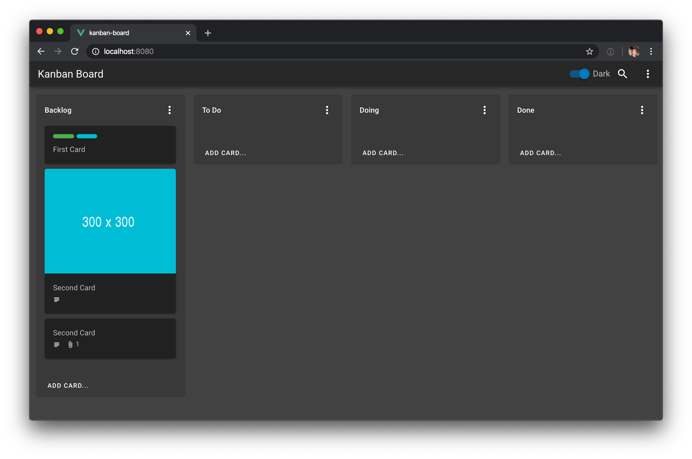

# Kanban board

Sample vue/vuetify layout for a kanban board web application.

- Supports drag and drop of list, cards and check items.
- Light / Dark theme

## Dark theme



## Light theme


## Use on your project

These components are build to be used anywhere with an small list of requirements:

- Vuetify 2.x
- Custom Vuetify theme to support dark and light theme (see more bellow)
- An specific board -> list -> card data structure (not that complicated)
- Extend as need

### Custom Vuetify theme

Since this project was created using [vue-cli](https://cli.vuejs.org/guide/creating-a-project.html) and [vuetify](https://vuetifyjs.com/en/getting-started/quick-start/#vue-cli-install), you will should match this `vuetify.js` plugin content:

```javascript
import Vue from 'vue';
import Vuetify from 'vuetify/lib';
import colors from 'vuetify/lib/util/colors';

Vue.use(Vuetify);

export default new Vuetify({
  theme: {
    themes: {
      light: {
        background: colors.grey.lighten3,
        list: colors.grey.lighten2,
      },
      dark: {
        background: colors.grey.darken3,
        list: "#393939",
        card: colors.grey.darken4,
        primary: colors.lightBlue.darken3,
        dialog: colors.grey.darken4,
      }
    }
  }
});
```

### Components

Theese components have a entry component used on this project as `Kanban.vue` which being used to display a single board and handle data interaction (i.e: creating a list, adding a card, reorder a check item).

- To use theme switcher on [App.vue](src/App.vue) there an example and make sure to copy the [AppLayout.vue](src/AppLayout.vue) to your project.
- To display a board copy your [Kanban.vue](src/Kanba.vue) to your project and include your component on your app.
- Then you should copy `src/components/kanban` folder to your project's `components` folder.

### Dependencies

This project uses a minimal list of dependencies that enables drag and drop and layout.

```bash
npm install -s core-js vuedraggable
```

If you're using `vue-cli` you can add `vuetify`:

```
vue add vuetify
```

## Development

### Install dependencies
```
npm install
```

### Compiles and hot-reloads for development
```
npm run serve
```

### Compiles and minifies for production
```
npm run build
```

### Run your tests
```
npm run test
```

### Lints and fixes files
```
npm run lint
```
